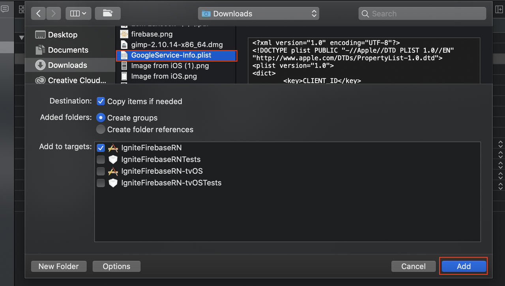

## **선행 조건**

- React Native 프로젝트 생성 (react-native-cli 혹은 ignite-cli를 사용하여: _**다음의 설명은 ignite-cli을 기준으로 함**_)
- iOS의 bundle identifier, Android의 패키지명 세팅 (예: com.example.igniteRN)

## **참고 문서**

- [https://invertase.io/oss/react-native-firebase/](https://invertase.io/oss/react-native-firebase/)
- [react-native-firebase](https://invertase.io/oss/react-native-firebase)

## **프로젝트에 모듈 설치**

- react-native-firebase를 사용하는 모든 프로젝트에는 App 모듈이 설치되어 있어야 함
- 프로젝트에 모듈을 추가

```shell
$ yarn add @react-native-firebase/app
```

- React Native 버전 0.60 이상은 Autolinking

## **Android: Firebase 세팅하기**

**1. Firebase Console에 프로젝트 추가**

- [Firebase Console](https://console.firebase.google.com/u/0/)로 이동하여 새로운 프로젝트를 추가


**2. Firebase 프로젝트에 Android 앱 추가**

- 프로젝트를 생성하고 나면 프로젝트에 Android 앱을 추가


**3. Android 앱에 Firebase 추가**

- Android 패키지 이름에는 이전에 미리 세팅한 **Android의 패키지 이름**을 정확하게 작성
- **Android Studio**를 실행
- 프로젝트의 Android 디렉토리를 열기
- Android Studio 우측에 **Gradle**을 클릭하고 **signingReport**를 실행


- signingReport가 실행되면 Android Studio의 **Run** 창에서 키의 **SHA1** 해시를 볼 수 있음
- 이 SHA1 해시를 복사
- Firebase Console의 **디버그 서명 인증서 SHA-1** 항목에 붙여넣기
- 앱 등록을 클릭
- 그 뒤로는 계속 안내대로 진행
- **구성 파일(google-services.json)을 다운로드하여 app 디렉토리에 넣기**
- **Firebase SDK를 추가하고, Sync**
- **에뮬레이터로 앱을 실행**
- 에뮬레이터로 앱을 실행하고 나면 마지막에 설치 확인이 끝남


## **iOS: Firebase 세팅하기**

**1. Firebase 프로젝트에 iOS 앱 추가**

- Android와 동일하게 iOS 아이콘을 클릭하여 iOS 앱을 추가

**2. iOS 앱에 Firebase 추가**

- Android 앱을 추가할 때 했던 것과 동일한 과정으로 **앱을 등록**
- **구성파일(GoogleService-Info.plist)을 다운로드**
- **XCode 프로젝트를 열어 다음과 같이 파일을 추가**
- **Add Files to "프로젝트 이름"...**을 클릭
- **구성파일을 선택해서 추가**




- **아이폰 에뮬레이터에 앱을 빌드하고 설치를 확인**
- iOS 세팅도 완료

## **구글 로그인 추가하기**

**1. Firebase Console에서 로그인 방법에 Google 추가**

- Firebase Console에서 **개발 > Authentication**을 클릭


**2. 로그인 방법에서 Google 선택**

- Google을 클릭하면 프로젝트 공개용 이름과 프로젝트 지원 이메일을 입력하는 곳이 있음


- **앱의 이름과 Firebase Console 접속 이메일로 입력**
- **사용 설정을 클릭**
- **상태를 사용 설정됨으로 변경**

**3. Xcode 프로젝트에서 URL Schemes 설정**


- **GoogleService-Info.plist)**을 클릭
- `REVERSED_CLIENT_ID`의 값을 복사
- 복사한 값을 프로젝트의 **Info > URL Types 클릭 > + 버튼을 눌러 추가**한 뒤 **URL Schemes에 붙여넣기**

**4. React Native 프로젝트에 auth 모듈 설치**

- 프로젝트 루트로 이동
- **@react-native-firebase/app** 모듈을 설치

```shell
$ yarn add @react-native-firebase/auth
$ # Using iOS
$ cd ios/ && pod install
```

**5. google-signin 모듈 설치**

- **@react-native-community/google-signin** 라이브러리를 설치

```shell
$ yarn add @react-native-community/google-signin
```

**6. google-signin 라이브러리 Configure**

- **app/app.tsx(앱의 진입점)**에 다음과 같은 코드를 입력

```javascript
import { GoogleSignin } from '@react-native-community/google-signin'

const googleSigninConfigure = async () => {
  await GoogleSignin.configure({
    scopes: [],
    webClientId:
      'Firebase Console의 Google 로그인 방법 설정에서 복사한 웹 클라이언트 ID 붙여넣기',
  })
}
```

- Firebase Console에서 **웹 클라이언트 ID**를 복사
- 위 코드에서 **webClientID의 값**에 붙여넣기


- 위에서 작성한 **googleSigninConfigure**를 App component의 **useEffect** hook 안에서 호출

```javascript
useEffect(() => {
  googleSigninConfigure()
}, [])
```

**7. Authentication Flow 구성**


- **Authloading**과 **Signin screen**을 만들기
- **auth navigator**를 생성


- **primary navigator**를 import

**8. Authloading Screen 수정**

- useEffect hook에서 **onAuthStateChanged()** 메소드를 호출
- **user가 있다면 primary**로 이동
- **그렇지 않다면 signin**으로 이동

```javascript
import { firebase } from "@react-native-firebase/auth

export const AuthloadingScreen: React.FunctionComponent<AuthloadingScreenProps> = observer(
  props => {
    React.useEffect(() => {
      firebase.auth().onAuthStateChanged(user => {
        props.navigation.navigate(user ? "primary" : "signin")
      })
    })
    return (
      <Screen style={ROOT}>
        <Text preset="header" text="Auth loading" />
      </Screen>
    )
  },
)
```

**9. Signin Screen 수정**

```javascript
import { GoogleSignin } from '@react-native-community/google-signin'
import { firebase } from '@react-native-firebase/auth'

const googleSignin = async () => {
  try {
    const { idToken } = await GoogleSignin.signIn()
    const credential = firebase.auth.GoogleAuthProvider.credential(idToken)
    await firebase.auth().signInWithCredential(credential)

    const user = firebase.auth().currentUser
    if (user) {
      props.navigation.navigate('primary')
    } else {
      props.navigation.navigate('signin')
    }
  } catch (e) {
    console.log(e)
  }
}
```

- GoogleSignin의 **signIn 메소드를 호출**하여 **idToken**을 받아옴
- 그 **토큰으로 firebase 자격 증명을 생성**
- **생성한 자격 증명으로 firebase에 로그인**
- 로그인이 되었다면 currentUser에 user가 있고, **user 유무에 따라 navigator를 이동**

**10. 테스트를 위한 SignOut button 생성**

```javascript
const signOut = async () => {
    try {
      await firebase.auth().signOut()
      props.navigation.navigate("signin")
    } catch (e) {
      console.log(e)
    }
  }

 return (
 	...
    <Button
      style={DEMO}
      textStyle={DEMO_TEXT}
      text="SIGN OUT"
      onPress={signOut}
    />
    ...
    .....
  )
```

- 별다른 값을 넘겨줄 필요없이 signOut() 메소드를 호출하기만 하면 로그아웃
- 로그아웃 후 에러가 없다면 Signin Screen으로 이동시킴

**11. 에뮬레이터에서 확인하기**


