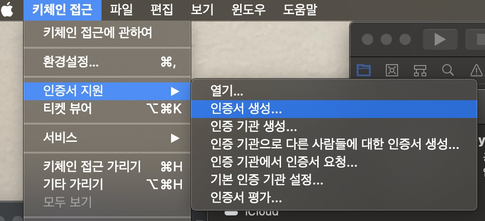
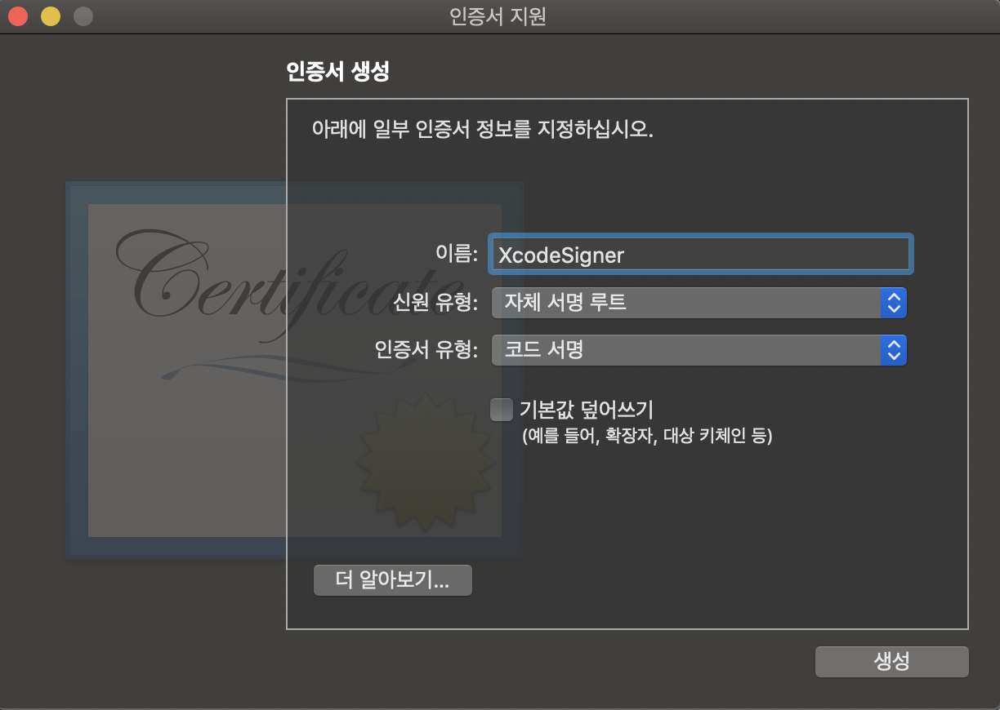

### XcodeSigner 키 생성

1. 키체인 접근 열기
2. 상단에 `키체인 접근 > 인증서 지원 > 인증서 생성`

   

3. 이름에 `XcodeSigner` 입력
4. 인증서 유형에 `코드 서명` 선택

   

5. 생성 클릭

### Xcode App에 서명

```shell
$ sudo codesign -f -s XcodeSigner /Applications/Xcode.app
```

### XVim2 source code

```shell
$ git clone https://github.com/XVimProject/XVim2.git
$ cd XVim2
$ make
```

### XCode에 load Bundle

1. XCode 앱 열기
2. `Unexpected code bundle "XVim2.xcplugin"` 창이 뜸
3. `Load Bundle` 버튼 클릭
